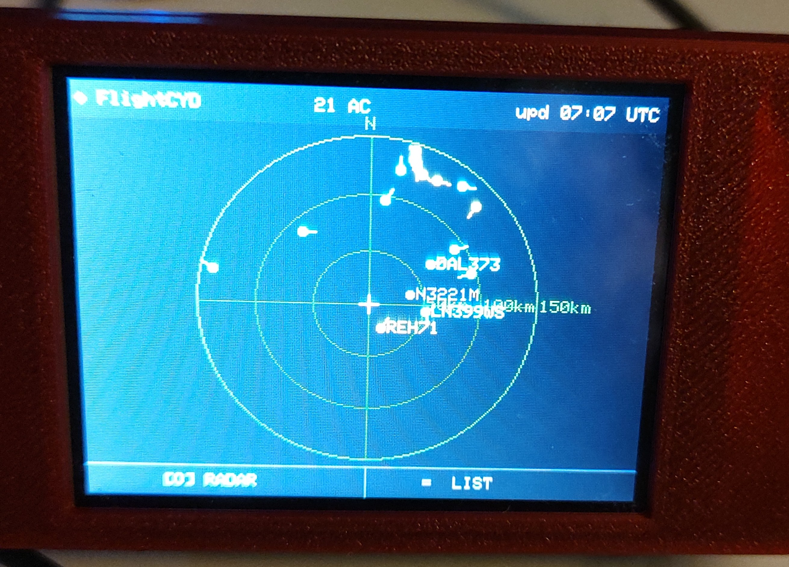
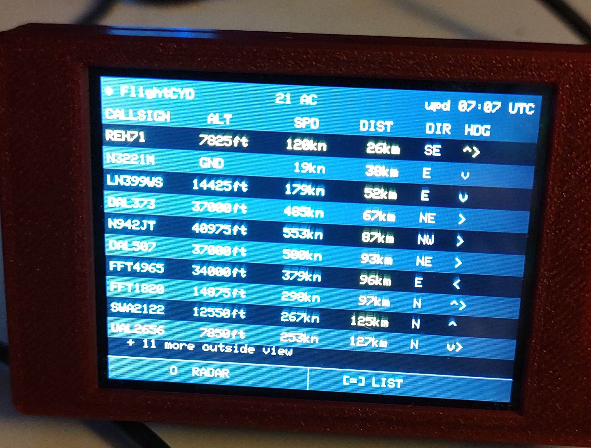

# ✈️ FlightRadarCYD — Live Aircraft Radar for the ESP32 CYD

A live aircraft radar and flight tracker built for the **ESP32 CYD** (Cheap Yellow Display — ILI9341 320×240 touchscreen). Pulls real-time ADS-B flight data from the **OpenSky Network** and displays it two ways: a radar sweep view centered on your location, and a sorted flight list with full details on tap. No API key required.

---

## 📸 Screenshots

| RADAR Mode | LIST Mode |
|:---:|:---:|
|  |  |

*21 aircraft detected, updated 07:07 UTC — real flights including DAL373, SWA2122, UAL2656, REH71*

---

## 📡 What It Does

FlightRadarCYD connects to your WiFi, fetches live ADS-B state vectors from OpenSky Network every 4 minutes, and gives you two display modes to explore the airspace around you.

### 🟢 RADAR Mode
- You are at the center crosshair `+`
- Aircraft appear as colored dots at their true bearing and distance
- A short heading tick line shows where each aircraft is going
- Three range rings labeled at 33% / 66% / 100% of your configured radius
- Aircraft in the inner half of the radar show their callsign label
- **Dot color by altitude:** cyan = high altitude cruise, yellow = low / approach, gray = on ground

### 📋 LIST Mode
- Closest 10 aircraft sorted by distance, with overflow count shown
- Columns: **CALLSIGN · ALT · SPD · DIST · DIR · HDG**
  - ALT in feet (or `GND` if on ground)
  - SPD in knots
  - DIST in km from your location
  - DIR as compass bearing (N / NE / SE / etc.)
  - HDG as an arrow symbol showing direction of travel
- **Tap any row** for a full detail overlay: ICAO hex, country, altitude, speed, bearing, heading
- Tap again to dismiss

---

## 🛠️ Hardware

| Component | Detail |
|---|---|
| Board | ESP32 CYD (Cheap Yellow Display) |
| Display | ILI9341 320×240 TFT (HWSPI) |
| Touch | XPT2046 resistive (VSPI: CLK=25, MISO=39, MOSI=32, CS=33, IRQ=36) |
| Backlight | GPIO 21 |
| Mode toggle | BOOT button (GPIO 0) |

---

## ⚙️ Setup

1. Flash the firmware with PlatformIO
2. On first boot, the device opens a WiFi access point: **`FlightRadarCYD_Setup`**
3. Connect to it and navigate to `192.168.4.1`
4. Enter your **WiFi credentials**, **latitude**, **longitude**, and **scan radius** (25 / 50 / 100 km, 15 / 30 / 60 mi, or custom up to 500 km / 310 mi)
5. Save — device restarts and begins tracking

> **Tip:** Hold the BOOT button on power-up at any time to re-open the setup portal and change your settings.

---

## 🔄 Switching Modes

- **BOOT button** — toggles between RADAR and LIST
- **Footer touch zones** — left half = RADAR, right half = LIST

---

## 📦 Data Source

| Source | Endpoint | Auth |
|---|---|---|
| [OpenSky Network](https://opensky-network.org) | `/api/states/all` (bounding box) | None — anonymous |

- Free anonymous access — approximately 400 requests/day
- 4-minute refresh interval uses ~360 requests/day, staying safely within the limit
- Returns ADS-B state vectors: position, altitude, velocity, heading, callsign, country

---

## 🗂️ Project Structure

```
FlightRadarCYD/
├── src/
│   └── main.cpp          # Display modes, touch, BOOT button, radar geometry
├── include/
│   ├── Portal.h          # Captive portal WiFi + location setup (NVS storage)
│   └── OpenSky.h         # OpenSky API fetch, parse, distance sort
├── INVERTEDFlightRadarCYD/    # Inverted display variant (black/white swapped)
└── platformio.ini
```

---

## 🔧 Build

```bash
cd FlightRadarCYD
pio run
pio run --target upload
```

> Uses `PaulStoffregen/XPT2046_Touchscreen` (git URL), `moononournation/GFX Library for Arduino@1.4.7`, and `bblanchon/ArduinoJson@^6`.

---

## 📺 Part of the CYD Desktop Series

FlightRadarCYD is part of a growing collection of always-on desktop displays built for the ESP32 CYD:

- **HackerCYD** — Live Hacker News comments and top stories
- **WeatherCore** — NWS forecasts, NOAA space weather, and ISS tracker with 145.800 MHz radio window
- **WikiCYD** — Random Wikipedia article display
- **SportsCYD** — ESPN live scores board
